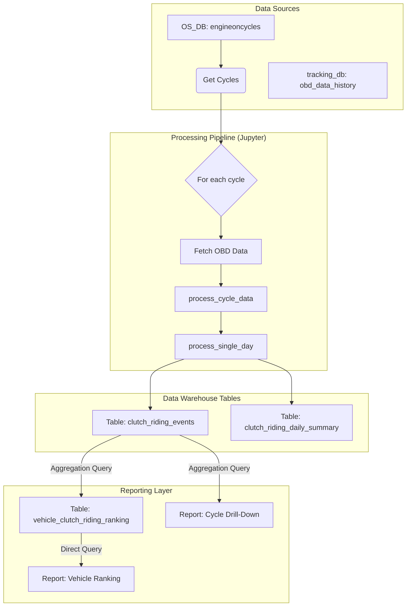
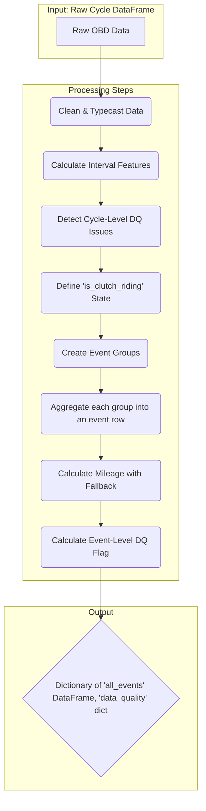

<div style="page-break-after: always;"></div>

# 1. Document Overview

## 1.1 Purpose
This document provides a comprehensive technical specification for the automated data pipeline that analyzes vehicle telemetry data to detect clutch riding events, calculates their impact on fuel efficiency, and generates structured, queryable data tables with robust quality flagging.

## 1.2 Scope
This document covers the end-to-end data pipeline, including data sources, detailed processing logic, data quality checks, the schema of the final output tables, and the data models for the customer-facing report.

# 2. Business Objective

## 2.1 Problem Statement
Inefficient driver behavior, specifically "clutch riding," leads to measurable fuel waste and increased vehicle maintenance costs. A systematic, data-driven approach is required to identify, quantify, and flag this behavior at scale across the fleet to enable targeted interventions and cost-saving initiatives.

## 2.2 Solution
An automated pipeline, executed via a Jupyter Notebook (`clutch_riding_production_7days.ipynb`), that transforms raw telemetry into two structured, persistent database tables that directly power a multi-level customer-facing report.

## 2.3 Success Metrics
- **Data Robustness:** The pipeline can successfully process any specified date range of historical data.
- **Hypothesis Validation:** The final dataset clearly demonstrates a statistically significant negative correlation between clutch riding and fuel efficiency.
- **Actionable Insight Generation:** The data proves that for "Long" and "Very Long" duration clutch riding events, mileage is worse than normal riding mileage in over 80% of observed cases.

<div style="page-break-after: always;"></div>

# 3. System Overview

## 3.1 High-Level Architecture
The system follows a two-stage database query process, followed by parallelized in-memory processing, and finally persists the results back to the database.



# 4. Data Sources

## 4.1 Input 1: Engine Cycles
- **Database:** `OS_DB`
- **Table:** `public.engineoncycles`
- **Purpose:** Provides the list of trips (engine on-to-off cycles) to be analyzed.

## 4.2 Input 2: OBD History
- **Database:** `tracking_db`
- **Table:** `public.obd_data_history`
- **Purpose:** Provides the core time-series telemetry for each cycle.

<div style="page-break-after: always;"></div>

# 5. Processing Logic

The core logic is executed by two main functions: `process_cycle_data` and `process_single_day`.

## 5.1 `process_cycle_data` Flow
This function processes the raw dataframe for a single cycle into a structured set of events and quality flags.



### 5.1.1 Event Grouping Logic
Events are created when the clutch riding status changes.

```python
# In process_cycle_data:
df['event_group'] = (df['is_clutch_riding'] != df['is_clutch_riding'].shift()).cumsum()
```

### 5.1.2 Fuel and Mileage Calculation with Fallback
To maximize data reliability, a fallback system is used to determine the definitive mileage for each event.

1.  **Primary Method (from `fuel_rate`):** The system first calculates mileage using the instantaneous `fuel_rate`.
2.  **Validation:** The result is validated against rules (e.g., mileage > 15 km/L).
3.  **Fallback Method (from `fuel_consumption`):** If the primary calculation is invalid, the system uses the mileage calculated from the cumulative `fuel_consumption` column.
4.  **Final Value:** The final `event_mileage_kmpl` column contains the best valid result. Both raw fuel calculations (`event_fuel_from_rate_liters` and `event_fuel_from_consumption_liters`) are kept for transparency.

## 5.2 Data Filtering and Validation Rules
The pipeline generates flags to identify questionable data without deleting it.

### 5.2.1 Event-Level Flags
-   `is_invalid_mileage_flag`: A `BOOLEAN` flag set to `True` if the final mileage for an event is considered invalid (e.g., > 15 km/L, or zero fuel for a moving event).

### 5.2.2 Cycle-Level Flags
-   `has_odometer_reset_flag`: A `BOOLEAN` flag set to `True` if the vehicle's odometer reading went backward during the cycle.
-   `has_data_gap_flag`: A `BOOLEAN` flag set to `True` if the time between any two consecutive data packets exceeded 45 seconds.
-   `is_short_duration_cycle`: A `BOOLEAN` flag set to `True` if the total cycle duration is less than 60 seconds.
-   `is_short_distance_cycle`: A `BOOLEAN` flag set to `True` if the total cycle distance is less than 0.1 km.

<div style="page-break-after: always;"></div>

# 6. Data Warehouse Output Specification

The pipeline produces two primary, persistent tables in the data warehouse.

## 6.1 Output 1: Event-Level Table
**Table Name:** `clutch_riding_events`
**Description:** Contains one row for every detected riding event. This is the source of truth for all other aggregations.

| Column Name | Data Type | Description |
|---|---|---|
| `event_id` | SERIAL | Primary Key |
| `cycle_id` | VARCHAR | Foreign key to the engine cycle |
| `uniqueid` | VARCHAR | Vehicle identifier |
| `event_type` | VARCHAR | 'clutch_riding' or 'normal_riding' |
| `event_start_ts`| BIGINT | Start timestamp of the event |
| `event_end_ts` | BIGINT | End timestamp of the event |
| `event_duration_sec`| FLOAT | Duration of the event in seconds |
| `event_distance_m`| FLOAT | Distance covered during the event in meters |
| `event_fuel_from_rate_liters` | FLOAT | Fuel consumed (from `fuel_rate`) |
| `event_fuel_from_consumption_liters` | FLOAT | Fuel consumed (from `fuel_consumption`) |
| `avg_speed_kmh` | FLOAT | Average speed during the event |
| `avg_rpm` | FLOAT | Average RPM during the event |
| `event_mileage_kmpl`| FLOAT | Final, unified mileage (km/L) for the event |
| `is_invalid_mileage_flag` | BOOLEAN | `True` if the final mileage is invalid. |
| `event_date` | DATE | The date the event occurred |

## 6.2 Output 2: Daily Summary Table
**Table Name:** `clutch_riding_daily_summary`
**Description:** Contains one row per vehicle per day, optimized for high-level dashboarding and drill-downs.

| Column Name | Data Type | Description |
|---|---|---|
| `analysis_date` | DATE | Date of analysis |
| `uniqueid` | VARCHAR | Vehicle identifier |
| `overall_distance_km`| FLOAT | Total distance traveled |
| `clutch_riding_mileage_kmpl`| FLOAT | Mileage during valid clutch riding events |
| `normal_riding_mileage_kmpl`| FLOAT | Mileage during valid normal riding events |
| `mileage_degradation_pct`| FLOAT | Percentage drop in mileage due to clutch riding |
| `is_short_duration_cycle` | BOOLEAN | `True` if total cycle duration is < 60 seconds |
| `is_short_distance_cycle` | BOOLEAN | `True` if total cycle distance is < 0.1 km |
| `has_data_gap_flag` | BOOLEAN | `True` if time between packets exceeded 45 seconds |
| `has_odometer_reset_flag`| BOOLEAN | `True` if the odometer reading went backward |
| | | **PRIMARY KEY (analysis_date, uniqueid)** |

<div style="page-break-after: always;"></div>

# 7. Customer-Facing Reporting

This section outlines the user interface (UI) and the data models required to power it.

## 7.1 User Flow
The customer will navigate to the feature via the main application dashboard:
**`Dashboard` -> `Driver Behaviour` -> `Clutch Riding Analysis`**

## 7.2 Level 1: Fleet Summary
The top of the page will display KPIs for the entire fleet, calculated on-the-fly from the data warehouse tables for the user-selected time period. No separate table is required for this view.

## 7.3 Level 2: Vehicle Ranking Report
Below the fleet summary, a table will rank vehicles to identify the most significant offenders. This report is powered by a dedicated reporting table, `vehicle_clutch_riding_ranking`, which stores daily snapshots.

### 7.3.1 Dynamic Date Range Strategy
The `vehicle_clutch_riding_ranking` table is aggregated **daily**. This ensures maximum query performance. To generate a report for a user-selected date range (e.g., "Last 7 Days"), the front-end query will aggregate these daily records on the fly (e.g., `SUM(total_clutch_riding_hours) WHERE ranking_date BETWEEN start AND end`). This provides full flexibility without sacrificing performance.

### 7.3.2 Reporting Table: `vehicle_clutch_riding_ranking`
**Description:** A pre-aggregated table to store the daily ranking of vehicles based on clutch riding severity. It specifically breaks down severe events into 'Long' and 'Very Long' categories to provide more granular insight.

| Column Name | Data Type | Description |
|---|---|---|
| `ranking_date` | DATE | The date the ranking was generated. |
| `vehicle_id` | VARCHAR(255) | The unique identifier for the vehicle. |
| `rank` | INT | The vehicle's rank on that day, based on total fuel wasted. |
| `long_event_duration_hours` | FLOAT | Total hours spent in **'Long'** duration clutch riding events. |
| `very_long_event_duration_hours` | FLOAT | Total hours spent in **'Very Long'** duration clutch riding events. |
| `long_event_count` | INT | The number of 'Long' duration clutch riding events. |
| `very_long_event_count` | INT | The number of 'Very Long' duration clutch riding events. |
| `fuel_wasted_liters` | FLOAT | Total fuel wasted from all severe clutch riding. |
| | | **PRIMARY KEY (ranking_date, vehicle_id)** |

### 7.3.3 SQL Schema
```sql
CREATE TABLE vehicle_clutch_riding_ranking (
    ranking_date DATE,
    vehicle_id VARCHAR(255),
    rank INT,
    long_event_duration_hours FLOAT,
    very_long_event_duration_hours FLOAT,
    long_event_count INT,
    very_long_event_count INT,
    fuel_wasted_liters FLOAT,
    PRIMARY KEY (ranking_date, vehicle_id)
);
```

### 7.3.4 SQL Generation Logic
The `vehicle_clutch_riding_ranking` table is populated daily using the following SQL query, which aggregates data from the `clutch_riding_events` table.

```sql
-- This query generates the `vehicle_clutch_riding_ranking` table.
-- It aggregates event data daily for each vehicle to rank them based on the severity of clutch riding.

-- ASSUMPTIONS:
-- 1. 'Long' clutch riding events are defined as those with a duration between 61 and 300 seconds.
-- 2. 'Very Long' clutch riding events are defined as those with a duration greater than 300 seconds.
-- 3. Fuel wasted is calculated by comparing the fuel consumed during a clutch riding event
--    to the fuel that *would have been* consumed for the same distance if the vehicle
--    was operating at its average 'normal_riding' efficiency for that day.

WITH daily_normal_mileage AS (
    -- First, calculate the average mileage for 'normal_riding' events for each vehicle, each day.
    -- This provides a baseline efficiency for comparison.
    SELECT
        event_date,
        uniqueid AS vehicle_id,
        SUM(event_distance_m) / 1000.0 / SUM(event_fuel_from_consumption_liters) AS normal_riding_mileage_kmpl
    FROM
        clutch_riding_events
    WHERE
        event_type = 'normal_riding'
        AND is_invalid_mileage_flag = FALSE
        AND event_fuel_from_consumption_liters > 0
    GROUP BY
        event_date,
        uniqueid
),

severe_clutch_events AS (
    -- Next, identify all 'Long' and 'Very Long' clutch riding events, classify them, and calculate fuel wasted.
    SELECT
        e.event_date,
        e.uniqueid AS vehicle_id,
        e.event_duration_sec,
        -- Classify the severity of the clutch riding event
        CASE
            WHEN e.event_duration_sec > 300 THEN 'very_long'
            WHEN e.event_duration_sec > 60 THEN 'long'
            ELSE 'normal'
        END AS severity,
        -- Calculate wasted fuel for each severe event
        -- Formula: (fuel that should have been used) - (fuel actually used)
        ((e.event_distance_m / 1000.0) / dnm.normal_riding_mileage_kmpl) - e.event_fuel_from_consumption_liters AS fuel_wasted_liters
    FROM
        clutch_riding_events e
    JOIN
        daily_normal_mileage dnm ON e.uniqueid = dnm.vehicle_id AND e.event_date = dnm.event_date
    WHERE
        e.event_type = 'clutch_riding'
        AND e.event_duration_sec > 60 -- Only consider events longer than 60 seconds
        AND e.is_invalid_mileage_flag = FALSE
        AND dnm.normal_riding_mileage_kmpl > 0
),

daily_ranking_data AS (
    -- Aggregate the severe event data for each vehicle for each day
    SELECT
        event_date AS ranking_date,
        vehicle_id,
        -- Sum durations and counts for 'Long' events
        SUM(CASE WHEN severity = 'long' THEN event_duration_sec ELSE 0 END) / 3600.0 AS long_event_duration_hours,
        SUM(CASE WHEN severity = 'long' THEN 1 ELSE 0 END) AS long_event_count,
        -- Sum durations and counts for 'Very Long' events
        SUM(CASE WHEN severity = 'very_long' THEN event_duration_sec ELSE 0 END) / 3600.0 AS very_long_event_duration_hours,
        SUM(CASE WHEN severity = 'very_long' THEN 1 ELSE 0 END) AS very_long_event_count,
        -- Total fuel wasted is the sum of waste from all severe events
        SUM(CASE WHEN fuel_wasted_liters > 0 THEN fuel_wasted_liters ELSE 0 END) AS fuel_wasted_liters
    FROM
        severe_clutch_events
    GROUP BY
        event_date,
        vehicle_id
)

-- Final step: Rank the vehicles based on total wasted fuel for each day
SELECT
    ranking_date,
    vehicle_id,
    RANK() OVER (PARTITION BY ranking_date ORDER BY fuel_wasted_liters DESC) AS rank,
    long_event_duration_hours,
    very_long_event_duration_hours,
    long_event_count,
    very_long_event_count,
    fuel_wasted_liters
FROM
    daily_ranking_data;
```

## 7.4 Level 3: Cycle-Level Drill-Down
Clicking on a vehicle row in the ranking table will show a detailed, cycle-by-cycle breakdown. This view is powered by a direct aggregation query on the `clutch_riding_events` table, grouped by `cycle_id`. No additional table is required.

**Cycle Analysis for Vehicle: VEH-102**

| Cycle Date | Cycle Start Time | Mileage Degradation | Potential Savings (INR) |
| :--- | :--- | :--- | :--- |
| 2026-02-05 | 08:15 AM | 35.2% | ₹ 85.50 |
| 2026-02-05 | 11:30 AM | 15.8% | ₹ 42.10 |
| 2026-02-04 | 04:45 PM | 41.0% | ₹ 105.20 |
| ... | ... | ... | ... | 

### 7.4.1 SQL Generation Logic
The cycle-level drill-down is a live report generated by the following query. It aggregates data from `clutch_riding_events` and filters to show only those cycles where mileage degradation occurred.

```sql
-- This query generates the "Cycle-Level Drill-Down" report by aggregating
-- event data for each cycle. It is designed to be executed on-the-fly and only
-- shows cycles where clutch riding led to a measurable degradation in mileage.

-- ASSUMPTIONS:
-- 1. "Potential Savings (INR)" is calculated assuming a fuel price of 100 INR per liter.
-- 2. The query must be filtered for a specific vehicle and date range by the application.
-- 3. The source for the `Data Quality` flags is not present in the `clutch_riding_events` table
--    schema provided in the PRD, so 'N/A' is used as a placeholder.

WITH cycle_metrics AS (
    -- First, calculate key metrics for both event types within each cycle
    SELECT
        cycle_id,
        MIN(event_start_ts) AS cycle_start_ts,
        event_type,
        SUM(event_distance_m) / 1000.0 AS total_distance_km,
        SUM(event_fuel_from_consumption_liters) AS total_fuel_liters
    FROM
        clutch_riding_events
    -- WHERE uniqueid = '{vehicle_id}' AND event_date IN ({date_range}) -- Placeholder for app filtering
    GROUP BY
        cycle_id,
        event_type
),

cycle_comparison AS (
    -- Pivot the data to have normal and clutch riding metrics side-by-side for each cycle
    SELECT
        cycle_id,
        cycle_start_ts,
        MAX(CASE WHEN event_type = 'normal_riding' THEN total_distance_km / total_fuel_liters ELSE NULL END) AS normal_mileage_kmpl,
        MAX(CASE WHEN event_type = 'clutch_riding' THEN total_distance_km / total_fuel_liters ELSE NULL END) AS clutch_mileage_kmpl,
        MAX(CASE WHEN event_type = 'clutch_riding' THEN total_distance_km ELSE 0 END) AS clutch_distance_km,
        MAX(CASE WHEN event_type = 'clutch_riding' THEN total_fuel_liters ELSE 0 END) AS clutch_fuel_liters
    FROM
        cycle_metrics
    WHERE
        total_fuel_liters > 0
    GROUP BY
        cycle_id,
        cycle_start_ts
),

final_report_data AS (
    -- Calculate degradation, savings, and format the output for all cycles with clutch riding
    SELECT
        TO_CHAR(TO_TIMESTAMP(cycle_start_ts), 'YYYY-MM-DD') AS "Cycle Date",
        TO_CHAR(TO_TIMESTAMP(cycle_start_ts), 'HH:MI AM') AS "Cycle Start Time",
        -- Calculate mileage degradation
        CASE
            WHEN normal_mileage_kmpl > 0 AND clutch_mileage_kmpl > 0 THEN
                ROUND(
                    ( (normal_mileage_kmpl - clutch_mileage_kmpl) / normal_mileage_kmpl ) * 100
                , 2)
            ELSE 0
        END AS "Mileage Degradation",
        -- Calculate potential savings, assuming 100 INR/liter
        CASE
            WHEN normal_mileage_kmpl > 0 AND clutch_mileage_kmpl > 0 AND normal_mileage_kmpl > clutch_mileage_kmpl THEN
                ROUND(
                    ((clutch_distance_km / normal_mileage_kmpl) - clutch_fuel_liters) * 100.0
                , 2)
            ELSE 0
        END AS "Potential Savings (INR)",
        'N/A' AS "Data Quality" -- Placeholder for unavailable DQ flags
    FROM
        cycle_comparison
    WHERE
        clutch_mileage_kmpl IS NOT NULL -- Only include cycles that have clutch riding
)

-- Final step: Filter for cycles with actual mileage degradation
SELECT *
FROM final_report_data
WHERE "Mileage Degradation" > 0
ORDER BY "Cycle Date" DESC, "Cycle Start Time" DESC;
```
### 7.4.1 SQL Generation Logic
The cycle-level drill-down is a live report generated by the following query when a user selects a vehicle. The query aggregates data from `clutch_riding_events` for the specified vehicle and date range.

```sql
-- This query generates the "Cycle-Level Drill-Down" report by aggregating
-- event data for each cycle. It is designed to be executed on-the-fly.

-- ASSUMPTIONS:
-- 1. "Potential Savings (INR)" is calculated assuming a fuel price of 100 INR per liter.
-- 2. The query must be filtered for a specific vehicle and date range by the application.
-- 3. The source for the `Data Quality` flags is not present in the `clutch_riding_events` table
--    schema provided in the PRD, so 'N/A' is used as a placeholder.

WITH cycle_metrics AS (
    -- First, calculate key metrics for both event types within each cycle
    SELECT
        cycle_id,
        MIN(event_start_ts) AS cycle_start_ts,
        event_type,
        SUM(event_distance_m) / 1000.0 AS total_distance_km,
        SUM(event_fuel_from_consumption_liters) AS total_fuel_liters
    FROM
        clutch_riding_events
    -- WHERE uniqueid = '{vehicle_id}' AND event_date IN ({date_range}) -- Placeholder for app filtering
    GROUP BY
        cycle_id,
        event_type
),

cycle_comparison AS (
    -- Pivot the data to have normal and clutch riding metrics side-by-side for each cycle
    SELECT
        cycle_id,
        cycle_start_ts,
        MAX(CASE WHEN event_type = 'normal_riding' THEN total_distance_km / total_fuel_liters ELSE NULL END) AS normal_mileage_kmpl,
        MAX(CASE WHEN event_type = 'clutch_riding' THEN total_distance_km / total_fuel_liters ELSE NULL END) AS clutch_mileage_kmpl,
        MAX(CASE WHEN event_type = 'clutch_riding' THEN total_distance_km ELSE 0 END) AS clutch_distance_km,
        MAX(CASE WHEN event_type = 'clutch_riding' THEN total_fuel_liters ELSE 0 END) AS clutch_fuel_liters
    FROM
        cycle_metrics
    WHERE
        total_fuel_liters > 0
    GROUP BY
        cycle_id,
        cycle_start_ts
)

-- Final step: Calculate degradation, savings, and format the output
SELECT
    TO_CHAR(TO_TIMESTAMP(cycle_start_ts), 'YYYY-MM-DD') AS "Cycle Date",
    TO_CHAR(TO_TIMESTAMP(cycle_start_ts), 'HH:MI AM') AS "Cycle Start Time",
    -- Calculate mileage degradation
    CASE
        WHEN normal_mileage_kmpl > 0 THEN
            ROUND(
                GREATEST(
                    0,
                    ( (normal_mileage_kmpl - clutch_mileage_kmpl) / normal_mileage_kmpl ) * 100
                ),
            2)
        ELSE 0
    END AS "Mileage Degradation",
    -- Calculate potential savings, assuming 100 INR/liter
    CASE
        WHEN normal_mileage_kmpl > clutch_mileage_kmpl THEN
            ROUND(
                ((clutch_distance_km / normal_mileage_kmpl) - clutch_fuel_liters) * 100.0,
            2)
        ELSE 0
    END AS "Potential Savings (INR)",
    'N/A' AS "Data Quality" -- Placeholder for unavailable DQ flags
FROM
    cycle_comparison
WHERE
    clutch_mileage_kmpl IS NOT NULL -- Only include cycles that have clutch riding
ORDER BY
    cycle_start_ts DESC;
```
