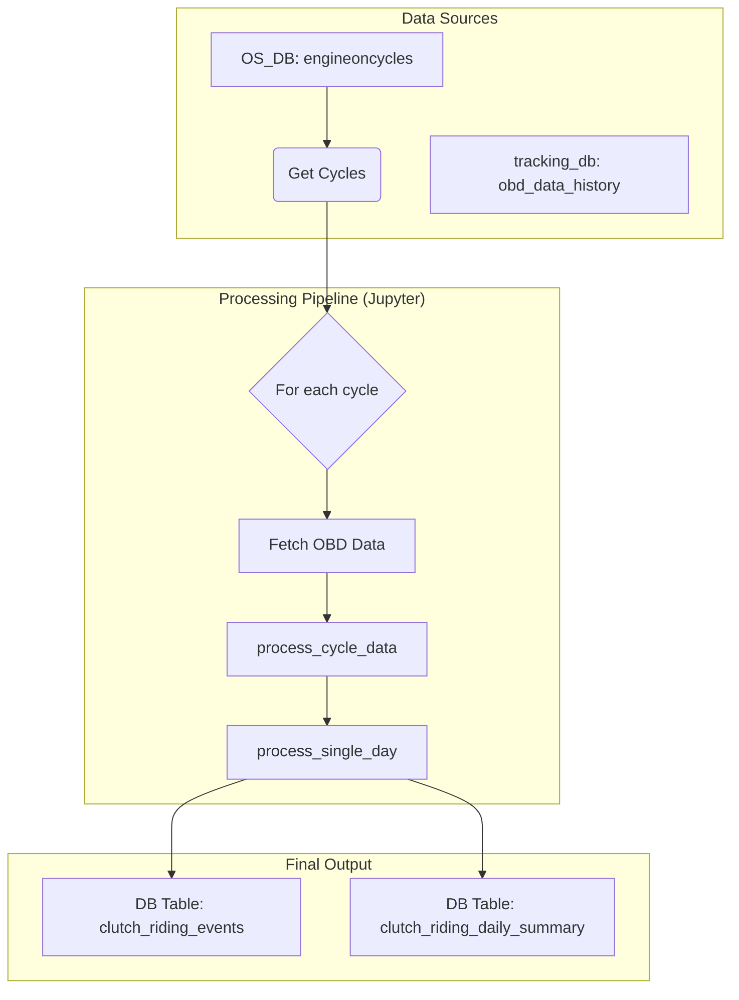
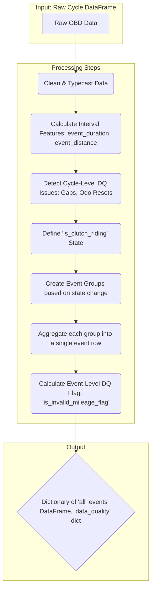
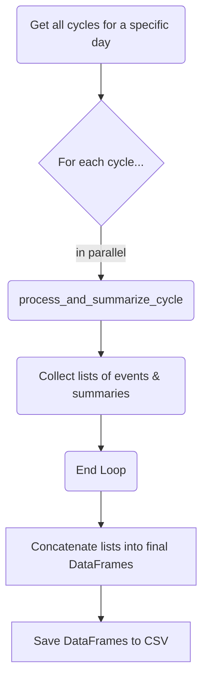

<div style="page-break-after: always;"></div>

# 1. Document Overview

## 1.1 Purpose
This document provides a comprehensive technical specification for the automated data pipeline that analyzes vehicle telemetry data to detect clutch riding events, calculates their impact on fuel efficiency, and generates structured, queryable data tables with robust quality flagging.

## 1.2 Scope
This document covers the end-to-end data pipeline, including data sources, detailed processing logic, data quality checks, and the schema of the final output tables intended for analytical use and dashboarding.

# 2. Business Objective

## 2.1 Problem Statement
Inefficient driver behavior, specifically "clutch riding," leads to measurable fuel waste and increased vehicle maintenance costs. A systematic, data-driven approach is required to identify, quantify, and flag this behavior at scale across the fleet to enable targeted interventions and cost-saving initiatives.

## 2.2 Solution
An automated pipeline, executed via a Jupyter Notebook (`clutch_riding_production_7days.ipynb`), that transforms raw telemetry into two structured, persistent database tables: one granular event-level table and one daily vehicle summary table, complete with data quality flags.

## 2.3 Success Metrics
- **Data Robustness:** The pipeline can successfully process any specified date range of historical data.
- **Hypothesis Validation:** The final dataset clearly demonstrates a statistically significant negative correlation between clutch riding and fuel efficiency.
- **Actionable Insight Generation:** The data proves that for "Long" and "Very Long" duration clutch riding events, mileage is worse than normal riding mileage in over 80% of observed cases.

<div style="page-break-after: always;"></div>

# 3. System Overview

## 3.1 High-Level Architecture
The system follows a two-stage database query process, followed by parallelized in-memory processing, and finally persists the results back to the database.



# 4. Data Sources

## 4.1 Input 1: Engine Cycles
- **Database:** `OS_DB`
- **Table:** `public.engineoncycles`
- **Purpose:** Provides the list of trips (engine on-to-off cycles) to be analyzed.

## 4.2 Input 2: OBD History
- **Database:** `tracking_db`
- **Table:** `public.obd_data_history`
- **Purpose:** Provides the core time-series telemetry for each cycle.

<div style="page-break-after: always;"></div>

# 5. Processing Logic

The core logic is executed by two main functions: `process_cycle_data` and `process_single_day`.

## 5.1 `process_cycle_data` Flow
This function processes the raw dataframe for a single cycle into a structured set of events and quality flags.



### 5.1.1 Data Quality Flagging (Packet-Level)
Before cleaning the data, flags are generated by inspecting the raw interval differences.

```python
# In process_cycle_data:
data_quality = {
    'cycle_id': cycle_id,
    'has_odometer_reset': (df['event_distance'] < 0).any(),
    'has_data_gap': (df['event_duration'] > 45).any(),
    'fuel_all_null': df['fuel_rate'].isna().all()
}
# Clean up invalid diffs after flagging
df.loc[df['event_distance'] < 0, 'event_distance'] = 0
```

### 5.1.2 Event Grouping Logic
Events are created only when the clutch riding status changes.

```python
# In process_cycle_data:
df['event_group'] = (df['is_clutch_riding'] != df['is_clutch_riding'].shift()).cumsum()
```

### 5.1.3 Event Aggregation & Flagging
Each group is aggregated, and the invalid mileage flag is calculated.

```python
# In process_cycle_data, inside the event aggregation loop:
mileage = (event_distance_m / 1000) / event_fuel_liters if event_fuel_liters > 0 else 0

event = {
    # ... other fields
    'event_mileage_from_rate_kmpl': mileage,
    'is_invalid_mileage_flag': (mileage > 15) or (event_fuel_liters <= 0 and event_distance_m > 1)
}
```

## 5.2 `process_single_day` Flow
This function orchestrates the processing for all cycles on a given day and generates the final summary tables.



### 5.2.1 Cycle Summary Generation
Inside the main processing loop, a summary row is created for each cycle, including the cycle-level flags.

```python
# In process_single_day, inside the processing loop for a cycle:
cycle_summary = {
    'cycle_date': analysis_date,
    'cycle_id': cycle_row['cycle_id'],
    'uniqueid': cycle_row['uniqueid'],
    # ... overall metrics ...
    'clutch_riding_mileage_kmpl': round(clutch_mileage_kmpl, 2),
    'normal_riding_mileage_kmpl': round(normal_mileage_kmpl, 2),
    # ... degradation metrics ...

    # Final Validation Flags
    'is_short_duration_cycle': cycle_row['cycle_duration_sec'] < 60,
    'is_short_distance_cycle': overall_distance_km < 0.1,
    'has_data_gap_flag': dq_dict['has_data_gap'],
    'has_odometer_reset_flag': dq_dict['has_odometer_reset']
}
```

<div style="page-break-after: always;"></div>

# 6. OUTPUT SPECIFICATION

The pipeline produces two primary, persistent tables in the database.

## 6.1 Output 1: Event-Level Table
**Proposed Table Name:** `clutch_riding_events`
**Description:** Contains one row for every detected riding event, designed for deep analysis.

| Column Name | Data Type | Description |
|---|---|---|
| `cycle_id` | VARCHAR | Foreign key to the engine cycle |
| `uniqueid` | VARCHAR | Vehicle identifier |
| `event_type` | VARCHAR | 'clutch_riding' or 'normal_riding' |
| `event_start_ts`| INTEGER | Start timestamp of the event |
| `event_end_ts` | INTEGER | End timestamp of the event |
| `event_duration_sec`| FLOAT | Duration of the event in seconds |
| `event_distance_m`| FLOAT | Distance covered during the event in meters |
| `event_fuel_from_rate_liters` | FLOAT | Fuel consumed (from `fuel_rate`) |
| `avg_speed_kmh` | FLOAT | Average speed during the event |
| `avg_rpm` | FLOAT | Average RPM during the event |
| `event_mileage_from_rate_kmpl`| FLOAT | Mileage (km/L) for the event |
| `is_invalid_mileage_flag` | BOOLEAN | `True` if mileage is > 15 or fuel/distance is zero. |
| `event_date` | DATE | The date the event occurred |

## 6.2 Output 2: Daily Summary Table
**Proposed Table Name:** `clutch_riding_daily_summary`
**Description:** Contains one row per vehicle per day, optimized for dashboards and reporting.

| Column Name | Data Type | Description |
|---|---|---|
| `analysis_date` | DATE | Date of analysis |
| `uniqueid` | VARCHAR | Vehicle identifier |
| `overall_distance_km`| FLOAT | Total distance traveled |
| `clutch_riding_mileage_kmpl`| FLOAT | Mileage during clutch riding |
| `normal_riding_mileage_kmpl`| FLOAT | Mileage during normal riding |
| `mileage_degradation_pct`| FLOAT | Percentage drop in mileage due to clutch riding |
| `is_short_duration_cycle` | BOOLEAN | `True` if total cycle duration is < 60 seconds |
| `is_short_distance_cycle` | BOOLEAN | `True` if total cycle distance is < 0.1 km |
| `has_data_gap_flag` | BOOLEAN | `True` if time between packets exceeded 45 seconds |
| `has_odometer_reset_flag`| BOOLEAN | `True` if the odometer reading went backward |

<div style="page-break-after: always;"></div>

# 7. IMPLEMENTATION DETAILS

## 7.1 Key Dependencies
- Python 3.x
- Pandas
- SQLAlchemy
- Psycopg2
- TQDM

## 7.2 Execution Strategy
The process is run within a Jupyter Notebook (`clutch_riding_production_7days.ipynb`). It uses a `ThreadPoolExecutor` to parallelize the processing of each cycle. A JSON file is used to track the processing status of each day.

## 7.3 Data Destination
The final dataframes (`final_events_df`, `final_cycles_df`) are saved to CSV files in a daily batch directory. A separate process will be responsible for loading these CSVs into the final database tables.
