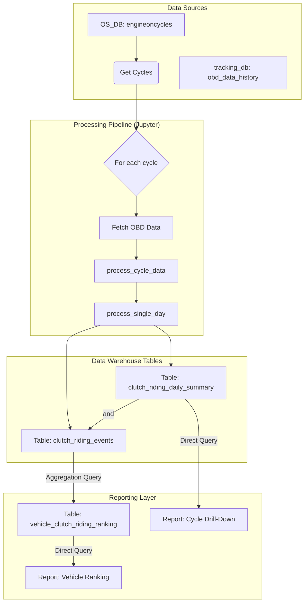

<div style="page-break-after: always;"></div>

# 1. Document Overview

## 1.1 Purpose
This document provides a comprehensive technical specification for the automated data pipeline that analyzes vehicle telemetry data to detect clutch riding events, calculates their impact on fuel efficiency, and generates structured, queryable data tables with robust quality flagging.

## 1.2 Scope
This document covers the end-to-end data pipeline, including data sources, detailed processing logic, data quality checks, the schema of the final output tables, and the data models for the customer-facing report.

# 2. Business Objective

## 2.1 Problem Statement
Inefficient driver behavior, specifically "clutch riding," leads to measurable fuel waste and increased vehicle maintenance costs. A systematic, data-driven approach is required to identify, quantify, and flag this behavior at scale across the fleet to enable targeted interventions and cost-saving initiatives.

## 2.2 Solution
An automated pipeline, executed via a Jupyter Notebook (`clutch_riding_production_7days.ipynb`), that transforms raw telemetry into two structured, persistent database tables that directly power a multi-level customer-facing report.

## 2.3 Success Metrics
- **Data Robustness:** The pipeline can successfully process any specified date range of historical data.
- **Hypothesis Validation:** The final dataset clearly demonstrates a statistically significant negative correlation between clutch riding and fuel efficiency.
- **Actionable Insight Generation:** The data proves that for "Long" and "Very Long" duration clutch riding events, mileage is worse than normal riding mileage in over 80% of observed cases.

<div style="page-break-after: always;"></div>

# 3. System Overview

## 3.1 High-Level Architecture
The system follows a two-stage database query process, followed by parallelized in-memory processing, and finally persists the results back to the database.



# 4. Data Sources

## 4.1 Input 1: Engine Cycles
- **Database:** `OS_DB`
- **Table:** `public.engineoncycles`
- **Purpose:** Provides the list of trips (engine on-to-off cycles) to be analyzed.

## 4.2 Input 2: OBD History
- **Database:** `tracking_db`
- **Table:** `public.obd_data_history`
- **Purpose:** Provides the core time-series telemetry for each cycle.

<div style="page-break-after: always;"></div>

# 5. Processing Logic

The core logic is executed by two main functions: `process_cycle_data` and `process_single_day`.

## 5.1 `process_cycle_data` Flow
This function processes the raw dataframe for a single cycle into a structured set of events and quality flags.


### 5.1.1 Event Grouping Logic
Events are created when the clutch riding status changes.

```python
# In process_cycle_data:
df['event_group'] = (df['is_clutch_riding'] != df['is_clutch_riding'].shift()).cumsum()
```

### 5.1.2 Fuel and Mileage Calculation with Fallback
To maximize data reliability, a fallback system is used to determine the definitive mileage for each event.

1.  **Primary Method (from `fuel_rate`):** The system first calculates mileage using the instantaneous `fuel_rate`.
2.  **Validation:** The result is validated against rules (e.g., mileage > 15 km/L).
3.  **Fallback Method (from `fuel_consumption`):** If the primary calculation is invalid, the system uses the mileage calculated from the cumulative `fuel_consumption` column.
4.  **Final Value:** The final `event_mileage_kmpl` column contains the best valid result. Both raw fuel calculations (`event_fuel_from_rate_liters` and `event_fuel_from_consumption_liters`) are kept for transparency.

## 5.2 Data Filtering and Validation Rules
The pipeline generates flags to identify questionable data without deleting it.

### 5.2.1 Event-Level Flags
-   `is_invalid_mileage_flag`: A `BOOLEAN` flag set to `True` if the final mileage for an event is considered invalid (e.g., > 15 km/L, or zero fuel for a moving event).

### 5.2.2 Cycle-Level Flags
-   `has_odometer_reset_flag`: A `BOOLEAN` flag set to `True` if the vehicle's odometer reading went backward during the cycle.
-   `has_data_gap_flag`: A `BOOLEAN` flag set to `True` if the time between any two consecutive data packets exceeded 45 seconds.
-   `is_short_duration_cycle`: A `BOOLEAN` flag set to `True` if the total cycle duration is less than 60 seconds.
-   `is_short_distance_cycle`: A `BOOLEAN` flag set to `True` if the total cycle distance is less than 0.1 km.

<div style="page-break-after: always;"></div>

# 6. Data Warehouse Output Specification

The pipeline produces two primary, persistent tables in the data warehouse.

## 6.1 Output 1: Event-Level Table
**Table Name:** `clutch_riding_events`
**Description:** Contains one row for every detected riding event. This is the source of truth for all other aggregations.

| Column Name | Data Type | Description |
|---|---|---|
| `event_id` | SERIAL | Primary Key |
| `cycle_id` | VARCHAR | Foreign key to the engine cycle |
| `uniqueid` | VARCHAR | Vehicle identifier |
| `event_type` | VARCHAR | 'clutch_riding' or 'normal_riding' |
| `event_start_ts`| BIGINT | Start timestamp of the event |
| `event_end_ts` | BIGINT | End timestamp of the event |
| `event_duration_sec`| FLOAT | Duration of the event in seconds |
| `event_distance_m`| FLOAT | Distance covered during the event in meters |
| `event_fuel_from_rate_liters` | FLOAT | Fuel consumed (from `fuel_rate`) |
| `event_fuel_from_consumption_liters` | FLOAT | Fuel consumed (from `fuel_consumption`) |
| `avg_speed_kmh` | FLOAT | Average speed during the event |
| `avg_rpm` | FLOAT | Average RPM during the event |
| `event_mileage_kmpl`| FLOAT | Final, unified mileage (km/L) for the event |
| `is_invalid_mileage_flag` | BOOLEAN | `True` if the final mileage is invalid. |
| `event_date` | DATE | The date the event occurred |

## 6.2 Output 2: Daily Summary Table
**Table Name:** `clutch_riding_daily_summary`
**Description:** Contains one row per vehicle per day, optimized for high-level dashboarding and drill-downs.

| Column Name | Data Type | Description |
|---|---|---|
| `analysis_date` | DATE | Date of analysis |
| `uniqueid` | VARCHAR | Vehicle identifier |
| `overall_distance_km`| FLOAT | Total distance traveled |
| `clutch_riding_mileage_kmpl`| FLOAT | Mileage during valid clutch riding events |
| `normal_riding_mileage_kmpl`| FLOAT | Mileage during valid normal riding events |
| `mileage_degradation_pct`| FLOAT | Percentage drop in mileage due to clutch riding |
| `is_short_duration_cycle` | BOOLEAN | `True` if total cycle duration is < 60 seconds |
| `is_short_distance_cycle` | BOOLEAN | `True` if total cycle distance is < 0.1 km |
| `has_data_gap_flag` | BOOLEAN | `True` if time between packets exceeded 45 seconds |
| `has_odometer_reset_flag`| BOOLEAN | `True` if the odometer reading went backward |
| | | **PRIMARY KEY (analysis_date, uniqueid)** |

<div style="page-break-after: always;"></div>

# 7. Customer-Facing Reporting

This section outlines the user interface (UI) and the data models required to power it.

## 7.1 User Flow
The customer will navigate to the feature via the main application dashboard:
**`Dashboard` -> `Driver Behaviour` -> `Clutch Riding Analysis`**

## 7.2 Level 1: Fleet Summary
The top of the page will display KPIs for the entire fleet, calculated on-the-fly from the data warehouse tables. No separate table is required for this view.

---
**Clutch Riding Fleet Overview**

| Total Vehicles Analyzed | Vehicles with Clutch Riding | Total Fuel Loss (Liters) | Estimated Savings Possible (INR) |
| :--- | :--- | :--- | :--- |
| 1,500 | 850 (57%) | 12,350 L | ₹ 1,111,500 |

---

## 7.3 Level 2: Vehicle Ranking Report
Below the fleet summary, a table will rank vehicles to identify the most significant offenders. This report is powered by a dedicated reporting table, `vehicle_clutch_riding_ranking`, which is populated daily.

### 7.3.1 Reporting Table: `vehicle_clutch_riding_ranking`
**Description:** A pre-aggregated table to store the daily ranking of vehicles based on clutch riding severity, ensuring fast report loading.

| Column Name | Data Type | Description |
|---|---|---|
| `ranking_date` | DATE | The date the ranking was generated. |
| `vehicle_id` | VARCHAR(255) | The unique identifier for the vehicle. |
| `rank` | INT | The vehicle's rank on that day. |
| `total_clutch_riding_hours` | FLOAT | Total hours spent clutch riding. |
| `long_very_long_event_count` | INT | The number of severe clutch riding events. |
| `fuel_wasted_liters` | FLOAT | Total fuel wasted from clutch riding. |
| | | **PRIMARY KEY (ranking_date, vehicle_id)** |

### 7.3.2 SQL Schema
```sql
CREATE TABLE vehicle_clutch_riding_ranking (
    ranking_date DATE,
    vehicle_id VARCHAR(255),
    rank INT,
    total_clutch_riding_hours FLOAT,
    long_very_long_event_count INT,
    fuel_wasted_liters FLOAT,
    PRIMARY KEY (ranking_date, vehicle_id)
);
```

## 7.4 Level 3: Cycle-Level Drill-Down
Clicking on a vehicle row in the ranking table will show a detailed, cycle-by-cycle breakdown. This view is powered by a direct query on the `clutch_riding_daily_summary` table. No additional table is required.

**Cycle Analysis for Vehicle: VEH-102**

| Cycle Date | Cycle Start Time | Mileage Degradation | Potential Savings (INR) | Data Quality |
| :--- | :--- | :--- | :--- | :--- |
| 2026-02-05 | 08:15 AM | 35.2% | ₹ 85.50 | None |
| 2026-02-05 | 11:30 AM | 15.8% | ₹ 42.10 | None |
| 2026-02-04 | 04:45 PM | 41.0% | ₹ 105.20 | `HAS_DATA_GAP`|
| ... | ... | ... | ... | ... |
